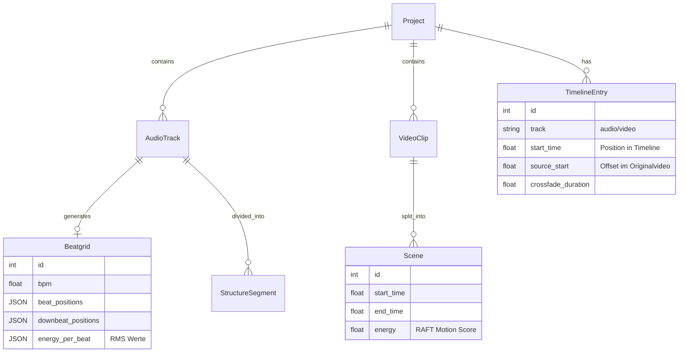
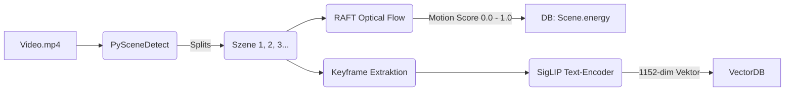

# PB Studio — Umfassendes Referenz-Handbuch (Technik, Architektur & Produkt)
## Version 0.5.0 — KI-gestützte Video-Produktion für DJs & Creator

---

## Inhaltsverzeichnis
1. [Einleitung & Kontext](#1-einleitung--kontext)
2. [Technologie-Stack & Werkzeuge](#2-technologie-stack--werkzeuge)
3. [Funktionsumfang (Was die App alles kann)](#3-funktionsumfang-was-die-app-alles-kann)
4. [Systemarchitektur & Datenfluss](#4-systemarchitektur--datenfluss)
5. [Datenbank-Design (Schema)](#5-datenbank-design-schema)
6. [Arbeitsprozesse: Audio-Pipeline](#6-arbeitsprozesse-audio-pipeline)
7. [Arbeitsprozesse: Video-Intelligence](#7-arbeitsprozesse-video-intelligence)
8. [Die Pacing-Engine (Das Herzstück)](#8-die-pacing-engine-das-herzstück)
9. [Export-Pipeline (FFmpeg-Magie)](#9-export-pipeline-ffmpeg-magie)
10. [Das Multi-Agenten-System (Orchestrator)](#10-das-multi-agenten-system-orchestrator)
11. [Praktische Anwendung (Workflow-Beispiel)](#11-praktische-anwendung-workflow-beispiel)
12. [Besonderheiten & USPs für Nachbau/Forschung](#12-besonderheiten--usps-für-nachbauforschung)

---

## 1. Einleitung & Kontext

**PB Studio** ist eine hochspezialisierte Desktop-Anwendung, die für die automatisierte Erstellung von beat-synchronen Musikvideos entwickelt wurde. Sie fungiert als "KI-Regisseur" und schließt die Lücke zwischen professioneller Audio-Analyse (DJ-Ebene) und intelligenter Video-Postproduktion.

### Wozu ist sie da?
*   **Für DJs und Musikproduzenten:** Anstatt stundenlang Videoclips manuell auf Beats zu schneiden, importiert der DJ sein Set (1-4 Stunden Länge) und einen Ordner mit Videomaterial. Die App generiert automatisch ein fertiges Video, das exakt auf die Drops, Breakdowns und Beats der Musik abgestimmt ist.
*   **Für Forscher:** Die App demonstriert fortschrittliches **Cross-Modal Matching** (die semantische und energetische Verbindung von Audio und Video) und zeigt, wie man schwere Deep-Learning-Pipelines auf Consumer-Hardware (z.B. einer GTX 1060 mit 6GB VRAM) lauffähig macht.

### Was macht sie speziell? (Kontext & Beispiele)
*   **Makro-Struktur-Verständnis:** Ein gewöhnlicher "Music Visualizer" reagiert nur auf den aktuellen Bass-Schlag. PB Studio analysiert den Track holistisch. Es erkennt, ob wir uns in einem "Warmup" oder einem "Drop" befinden.
    *   *Beispiel:* In einem Drop schneidet die App hart auf jede Kick-Drum (hohe Schnittrate, aggressives Videomaterial). In einem Breakdown (ruhigere Phase) macht sie sanfte 3-Sekunden-Überblendungen (Crossfades) und wählt atmosphärisches, ruhiges Videomaterial.
*   **Lokale KI (Privacy First):** Alle Modelle laufen offline. Keine Cloud-APIs, keine Abos, keine Upload-Zeiten für 20GB große DJ-Sets.

---

## 2. Technologie-Stack & Werkzeuge

Um die App exakt nachzubauen, muss dieser Tech-Stack eingehalten werden, da er auf spezifische Hardware-Restriktionen abgestimmt ist.

### Kern-Technologien
*   **Sprache:** Python 3.10 / 3.11 (optimiert für CUDA 11.3 bis 12.4).
*   **GUI-Framework:** PySide6 (Qt 6.8+). Gewählt wegen der asynchronen Signal/Slot-Architektur (`QThread`), um die UI während schwerer GPU-Berechnungen flüssig zu halten.
*   **Datenbank:** SQLite mit SQLAlchemy (ORM).
*   **Timeline-Format:** OpenTimelineIO (OTIO) – Industrie-Standard, um Sequenzen später potenziell an DaVinci Resolve oder Premiere Pro zu übergeben.

### KI-Modelle & Spezifische Tools
| Domäne | Technologie/Modell | Einsatzzweck in der App |
| :--- | :--- | :--- |
| **Audio (Beat)** | `beat_this` (CPJKU) | GPU-beschleunigte Erkennung von Beats und Downbeats (Taktschwerpunkten). |
| **Audio (Stems)**| `Demucs v4 (htdemucs_ft)`| Trennt den Originalmix in 4 Spuren: Vocals, Drums, Bass, Other. |
| **Video (Motion)**| `RAFT Small (torchvision)`| Optischer Fluss. Berechnet, wie viel "Bewegung" (Pixel-Verschiebung) in einem Video stattfindet. |
| **Video (Mood)** | `SigLIP-so400m` | Generiert 1152-dimensionale Vektoren aus Videoframes, um "Stimmung" mathematisch suchbar zu machen. |
| **KI-Strategie** | `Ollama` (Qwen2.5/Gemma4) | Lokales LLM, das als Chat-Bot dient und Pacing-Entscheidungen ("Wie soll ich schneiden?") trifft. |
| **Export/Render** | `FFmpeg` / `ffprobe` | Hardware-beschleunigtes Rendering (NVENC), LUFS-Normalisierung, Skalierung. |

---

## 3. Funktionsumfang (Was die App alles kann)

Die Anwendung ist seit dem SCHNITT-Redesign (2026-05-09) in **vier** klar definierte Tabs unterteilt: PROJEKT · MATERIAL & ANALYSE · SCHNITT · EXPORT.

1.  **PROJEKT Tab:**
    *   Projekt-Dashboard mit Status, Next-Step-Hinweisen, Systemstatus (CUDA, VRAM, FFmpeg).
2.  **MATERIAL & ANALYSE Tab (Ingest + KI-Pipelines):**
    *   Import von Audio- und Videodateien.
    *   Automatische Hardware-Prüfung (CUDA-Status, VRAM-Verfügbarkeit).
    *   Erstellung von Proxy-Videos (z.B. 540p Auflösung), damit die GUI beim Scrubben auf der Timeline nicht ruckelt.
    *   Startet die asynchronen Worker-Threads für Audio- und Videoanalyse.
    *   Zeigt detaillierten Status (AnalysisStatus) für jede Datei an.
3.  **SCHNITT Tab (Timeline & Pacing & Review):**
    *   Vier Sub-Tabs: **Schnitt** (Timeline), **Pacing & Anker**, **Audio**, **RL & Notes**.
    *   Empty-State mit Preset-Buttons (Smooth / Energetic / Cinematic / Custom) bevor eine Timeline existiert.
    *   Eine interaktive, DaVinci-Resolve-artige Timeline (mit Waveform-Rendering, Drag & Drop, Zoom).
    *   **Auto-Edit-Button:** Generiert die gesamte Timeline in Sekunden basierend auf den DJ-Reglern (Energy Reactivity, Vibe).
    *   **Manuelle Anker:** Der Nutzer kann ein bestimmtes Video an einen bestimmten Beat "pinnen" (z.B. "Zeige das Feuerwerk genau beim Drop"). Die KI plant den restlichen Schnitt um diese Anker herum.
4.  **EXPORT Tab (Delivery):**
    *   Audio-Normalisierung auf EBU R128 Standard (-14 LUFS).
    *   Zusammenfügen der Clips via FFmpeg (Stream-Copy oder Filtergraph mit Crossfades).

---

## 4. Systemarchitektur & Datenfluss

Die Architektur ist darauf ausgelegt, dass die schwere Datenverarbeitung die Benutzeroberfläche nicht blockiert und der VRAM (Video RAM) nicht überläuft.

### Architektur-Flussdiagramm

```mermaid
graph TD
    subgraph Frontend (PySide6)
        UI[User Interface]
        TL[Timeline Widget]
        Chat[KI Chat Dock]
    end

    subgraph Controller & Orchestration
        Orch[Orchestrator Agent]
        Worker[QThread Worker Dispatcher]
        MM[Model Manager Singleton]
    end

    subgraph KI Services (Backend)
        Demucs[Audio Service: Demucs/beat_this]
        Vision[Video Service: RAFT/SigLIP]
        Pacing[Pacing Engine]
        Ollama[Lokales LLM]
    end

    subgraph Persistenz
        DB[(SQLite / SQLAlchemy)]
        Files[Datei System: Proxies/Stems]
    end

    UI -->|Benutzeraktion| Worker
    Chat -->|Natürliche Sprache| Orch
    Orch -->|Routet an| Demucs
    Orch -->|Routet an| Vision
    Orch -->|Routet an| Pacing
    Orch -->|Fallback| Ollama

    Worker --> Demucs
    Worker --> Vision
    Worker --> Pacing

    Demucs <--> MM
    Vision <--> MM
    
    Demucs --> DB
    Vision --> DB
    Pacing --> TL
    
    MM -.->|Sperrt VRAM| Demucs
    MM -.->|Sperrt VRAM| Vision
```

### Der ModelManager (VRAM-Schutz)
Auf einer 6GB-Grafikkarte können SigLIP (2.5GB), Demucs (2GB) und ein LLM (3GB) nicht gleichzeitig existieren.
*   **Die Regel:** Der `ModelManager` ist ein Singleton mit einem `RLock` (Reentrant Lock).
*   **Der Prozess:** Bevor der `VisionService` SigLIP lädt, ruft er `ModelManager.ensure_loaded("siglip")` auf. Der Manager wirft automatisch das Demucs-Modell aus dem Speicher, führt `torch.cuda.empty_cache()` und `gc.collect()` aus und lädt erst dann SigLIP.
*   Das lokale LLM (Ollama) wird sogar explizit über die API auf Pause gesetzt, während andere Modelle arbeiten.

---

## 5. Datenbank-Design (Schema)

Um Forschung und Wiederherstellbarkeit zu garantieren, nutzt die App relationale Datenmodelle ohne echte Löschungen (Soft-Deletes).



*   **Besonderheit (AIPacingMemory):** Wenn der Nutzer einen von der KI generierten Schnitt auf der Timeline verschiebt, speichert die App dies im Memory. Beim nächsten Auto-Edit prüft die KI, ob der Nutzer eher schnellere oder langsamere Schnitte bevorzugt.

---

## 6. Arbeitsprozesse: Audio-Pipeline

Die Audio-Pipeline ist der Startpunkt. Ohne perfektes Audio-Verständnis ist kein guter Videoschnitt möglich.

### Schritt 1: Stem Separation (Demucs)
Der Track wird in Drums, Bass, Vocals und Other getrennt.
*   *Warum?* Um die visuelle Intensität zu steuern. Wenn nur die Vocals spielen (kein Beat), soll das Video ruhig sein. Sobald der Drop mit Kicks (Drums) und Sub-Bass einsetzt, muss das Video eskalieren.
*   *Problem & Lösung:* Ein 60-Minuten-Mix sprengt den RAM bei der Trennung. PB Studio implementiert **Chunked Processing**: Das Audio wird in 30-Sekunden-Blöcke (mit 2s Overlap) geteilt, einzeln durch die GPU gejagt und per Crossfade wieder zusammengefügt.

### Schritt 2: Beat & Downbeat Analyse (`beat_this`)
Analyse des Drum-Stems (um störende Melodien zu ignorieren). Erzeugt ein Array von Millisekunden-genauen Zeitstempeln für jeden Takt.

### Schritt 3: Makro-Struktur-Erkennung (Section Detection)
Der Code (`detect_sections`) berechnet einen gleitenden Mittelwert (Moving Average) der Energie.
*   **Warmup:** Start des Sets (Energie < 0.5).
*   **Buildup:** Energie-Gradient (Steigung) ist konstant positiv.
*   **Drop:** Energie springt schlagartig hoch (über 0.7).
*   **Breakdown:** Energie fällt ab (unter 0.3).

---

## 7. Arbeitsprozesse: Video-Intelligence

Videos werden "verstanden", bevor sie auf die Timeline gelegt werden.



*   **Beispiel Motion Score:** Ein Video von einem Wasserfall hat einen RAFT-Score von `0.1` (ruhig). Ein Video aus einem Moshpit hat einen Score von `0.85` (hektisch).
*   **Beispiel SigLIP Mood:** Der Forscher oder die KI kann nach dem Text "dark, aggressive, red lights" suchen. SigLIP vergleicht diesen Textvektor mit den Videovektoren via Cosinus-Ähnlichkeit (Cosine Similarity) und findet die beste Szene, ohne dass sie je manuell getaggt werden musste.

---

## 8. Die Pacing-Engine (Das Herzstück)

Hier laufen Audio und Video zusammen. Die Funktion `_match_video_for_segment` ist das Gehirn.

### Schritt 1: Die Effektive Schnitt-Rate ($S_{eff}$)
Wie oft wird geschnitten? Das System berechnet einen `effective_step` (z.B. alle 1, 2, 4 oder 8 Beats).
*   *Formel-Logik:* Basis-Rate (vom Nutzer eingestellt, z.B. 4) moduliert durch Sektion. In einem "Drop" zwingt die Engine den Step auf 1 (Schnitt auf jeden Kick).
*   *Vocal-Awareness:* Wenn das `compute_vocal_activity` Modul erkennt, dass im aktuellen Takt starker Gesang stattfindet, wird der `effective_step` verdoppelt (z.B. von 2 auf 4). *Grund:* Zu schnelle Schnitte während Gesang wirken auf den Menschen irritierend.

### Schritt 2: Cross-Modal Matching (Scoring Formel)
Für jeden Schnitt-Slot (z.B. Takt 32 bis Takt 36) wird jeder verfügbare Videoclip in der Datenbank bewertet.

`Fitness = (Energy_Match * 0.30) + (Mood_Match * 0.25) + (Coherence * 0.15) + (Freshness * 0.15) + (Beat_Sync * 0.15)`

*   **Energy_Match:** Wie gut passt der RAFT-Motion-Score des Videos zur berechneten RMS-Energie der Audio-Stems in diesem Slot?
*   **Mood_Match:** Passt die Stimmung? (z.B. "Breakdown" mapped auf Suchbegriffe wie "calm, atmospheric").
*   **Coherence (Visuelle Kontinuität):** Wie ähnlich ist das aktuelle Video dem *vorherigen* Video (Vektor-Vergleich)? Ein hoher Wert sorgt für ruhige Bildfolgen.
    *   *Ausnahme:* In einem "Drop" wird die Coherence *invertiert*. Das System sucht maximalen Kontrast (z.B. Farbwechsel von Blau auf Rot) für maximalen visuellen Impact.
*   **Beat_Sync (AUD-101):** Ein fortgeschrittener Algorithmus. Er prüft, ob die internen Szenenwechsel innerhalb eines langen Videoclips exakt auf die Beats der Musik fallen (Gauss-Falloff Scoring).

---

## 9. Export-Pipeline (FFmpeg-Magie)

Ein 60-Minuten-Set mit Schnitten auf jeden zweiten Beat bedeutet Tausende von winzigen Video-Fragmenten. Ein klassischer Render-Prozess würde Stunden dauern.

### Der Optimized Concat Prozess
1.  **Preprocessing-Check:** Das System prüft alle verwendeten Clips via `ffprobe`.
2.  **Standardisierung:** Nur Clips, die abweichen (falsche FPS, falsche Auflösung, nicht-H264 Codec) oder Farbkorrekturen (Brightness/Contrast) haben, werden einzeln vor-gerendert.
3.  **Stream-Copy (Der Trick):** Da nun alle Fragmente dasselbe Format haben, schreibt PB Studio eine Textdatei (`concat_file.txt`) mit In/Out-Points. FFmpeg nutzt den `concat` Demuxer mit `-c:v copy`.
    *   *Ergebnis:* Anstatt Frames neu zu berechnen, kopiert FFmpeg nur den Datenstrom. Ein 10-Minuten-Video rendert so in Sekundenbruchteilen.

### Filtergraph (Für Breakdowns)
Wenn Crossfades (Überblendungen) berechnet werden müssen, baut das System dynamisch einen riesigen FFmpeg Filtergraph (z.B. `[v0][v1]xfade=transition=fade:duration=2:offset=10[xf0]`).

### LUFS Normalisierung
Audio wird am Ende durch einen Zwei-Pass `loudnorm` Filter gejagt, um exakt `-14 LUFS` (Broadcast-Standard z.B. für YouTube) zu treffen.

---

## 10. Das Multi-Agenten-System (Orchestrator)

Der Chat an der Seite der App ist kein dummer Prompt-Eingabeschlitz. Er ist ein **Routing-System**.

### Wie es funktioniert (`OrchestratorAgent`)
Wenn der Nutzer schreibt: *"Was passiert in Video 1 und was wird gesagt?"*
1.  **Multi-Step-Detection:** Der Orchestrator erkennt Keywords für Bild ("passiert") und Ton ("gesagt").
2.  Er ruft den `VisionAgent` auf und leitet Video 1 durch Moondream2 (Image-to-Text). Ergebnis: *"Ein Mann tanzt."*
3.  Er ruft den `AudioAgent` auf und transkribiert den Vocal-Stem. Ergebnis: *"Yeah, let's go."*
4.  Er fasst beides zusammen und gibt es im UI aus.

### Fuzzy-Action-Registry
Wenn der Nutzer *"Mach mal proxies"* schreibt, sucht die Engine mit der `thefuzz` Bibliothek nach dem Action-Registry-Eintrag `create_proxy` (Score > 60%) und führt den Python-Code direkt aus, ohne ein schweres LLM zu bemühen. Nur bei unklaren Befehlen wird Gemma 4 als Schiedsrichter (Tiebreaker) genutzt.

---

## 11. Praktische Anwendung (Workflow-Beispiel)

Wie ein DJ oder Content Creator die App real nutzt:

1.  **Vorbereitung:** Der DJ zieht sein fertiges 2-Stunden MP3-Set in die App. Er zieht 50 abstrakte VJ-Loops (Videos) in den Medien-Pool.
2.  **Klick auf "Analyze All":**
    *   Die App arbeitet (bei 2h Audio ca. 15-30 Minuten).
    *   Stems werden getrennt, Beats gefunden, VJ-Loops analysiert und in Vektoren übersetzt.
3.  **Der Schnitt (Edit):**
    *   Der DJ geht in die Timeline. Er stellt den "Energy Reactivity" Slider auf 80% (aggressiv) und tippt bei Vibe "Cyberpunk, Neon" ein.
    *   Klick auf **"Auto-Edit"**.
    *   *Resultat:* Nach 5 Sekunden ist die Timeline voll. Im Warmup laufen ruhige, dunkle Videos. Beim ersten Drop hagelt es Stroboskop-artige Schnitte.
4.  **Feinschliff:** Dem DJ gefällt Sekunde 45:00 nicht. Er zieht manuell einen Clip aus dem Pool dorthin und klickt "Pin" (Anker). Er klickt nochmal Auto-Edit. Die KI plant nun *um diesen Clip herum*.
5.  **Export:** Klick auf Render. Die App normalisiert den Ton und spuckt das finale `.mp4` aus.

---

## 12. Besonderheiten & USPs für Nachbau/Forschung

Wenn dieses System zu Forschungszwecken reproduziert oder weiterentwickelt werden soll, sind diese technischen Eigenheiten zwingend zu beachten:

1.  **Windows DriverStore Injection:** Oft crasht PyTorch auf Windows-Laptops (Error 47), weil es die `nvcuda.dll` nicht findet. PB Studio sucht proaktiv in `C:\Windows\System32\DriverStore\FileRepository\`, findet den neuesten NVIDIA-Treiber und injiziert den Pfad via `os.add_dll_directory()` *bevor* PyTorch geladen wird.
2.  **OOM (Out-of-Memory) Decorator:** Die `@oom_recovery` Funktion wickelt jeden GPU-Aufruf (wie Demucs) ein. Wenn ein Fehler auftritt, fängt der Decorator den Crash ab, ruft `gc.collect()`, wartet 2 Sekunden, entlädt alle Modelle und versucht es bis zu 3-mal erneut. Das macht das System extrem robust gegen VRAM-Spitzen.
3.  **Soft-Deletes & SQLite Constraints:** In der Datenbank wird nie ein `DELETE FROM` genutzt. Alles bekommt einen `deleted_at` Zeitstempel. Warum? Weil die KI sonst bei inkonsistenten Timelines crasht.

---
*Erstellt als Architektur- & Produkt-Referenz. Stand der Technik: April 2026.*